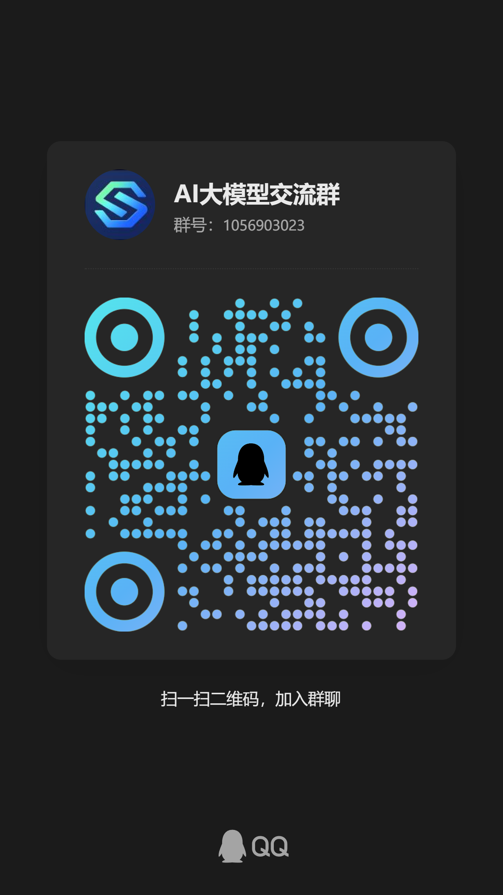

# Codex API 5.6 Model Fix

## 加入 AI 大模型交流群

[点击链接加入群聊【AI大模型交流群】](https://qm.qq.com/q/vQNgELRi2Q)



群号：`1056903023`

需要使用 Codex / ChatGPT API 模式显示 GPT-5.6 的用户，可以直接打开下面的完整中文修复教程，在文档的 **“11.6 Codex app 无法显示 GPT-5.6 模型”** 章节里复制修复提示词，然后粘贴给 Codex 执行。

- [打开完整中文修复教程](docs/chatgpt-codex-gpt-5.6-api-key-model-picker-fix.zh-CN.md#116-codex-app-无法显示-gpt-56-模型)

让 OpenAI Codex / ChatGPT 桌面应用在 API Key 模式、自定义 API 网关、自定义模型服务场景下显示 GPT-5.6 模型，例如 `gpt-5.6-sol`、`gpt-5.6-terra`、`gpt-5.6-luna`。

This repository documents a local compatibility patch for the OpenAI Codex / ChatGPT desktop app model picker. It helps API-key users with a custom OpenAI-compatible gateway expose GPT-5.6 models returned by the local app-server, without modifying the original Microsoft Store installation.

## 解决什么问题

在 Codex、ChatGPT Windows 桌面应用、OpenAI.Codex MSIX 包、API Key 登录模式或自定义 OpenAI API 代理网关中，后端已经能返回 `gpt-5.6-sol` / `gpt-5.6-terra` / `gpt-5.6-luna`，但模型选择器仍然看不到 GPT-5.6。

常见搜索词：

- Codex API 模式没有 5.6 模型
- ChatGPT API 登录没有 GPT-5.6
- OpenAI Codex app model picker hidden model
- Codex desktop custom model provider
- Codex API key mode model list
- ChatGPT Windows app app.asar patch
- OpenAI.Codex gpt-5.6-sol gpt-5.6-terra gpt-5.6-luna
- Codex 自定义网关模型列表刷新
- Codex app-server availableModels useHiddenModels
- model-list-filter amazonBedrock apikey

## 核心原因

桌面应用前端会对 app-server 返回的模型列表做二次过滤。API Key 模式下，即使自定义网关真实返回了 GPT-5.6，前端仍可能要求模型同时存在于远程 `availableModels` 白名单里，导致 GPT-5.6 被隐藏。

需要修改的语义是：

```javascript
useHiddenModels &&
authMethod !== "amazonBedrock" &&
authMethod !== "apikey"
```

也就是让 `apikey` 模式跳过远程模型白名单过滤，显示 app-server 实际返回且 `hidden=false` 的模型。

## 文档入口

- [完整中文修复教程](docs/chatgpt-codex-gpt-5.6-api-key-model-picker-fix.zh-CN.md)
- [Codex 5.6 一键修复提示词位置](docs/chatgpt-codex-gpt-5.6-api-key-model-picker-fix.zh-CN.md#116-codex-app-无法显示-gpt-56-模型)
- [原始排查记录](修复ChatGPT%20API登录时没有5.6模型.txt)
- [关键词与 GitHub Topics 建议](docs/keywords-and-topics.md)

## 适用场景

- Windows ChatGPT / Codex desktop app
- Microsoft Store 安装的 `OpenAI.Codex`
- OpenAI-compatible API gateway
- 自定义 API Key 网关
- 自建模型代理服务
- Codex CLI / Codex app 默认模型为 `gpt-5.6-sol`
- 模型列表中缺少 GPT-5.6、Sol、Terra、Luna

## 不适用场景

- 没有真实 GPT-5.6 上游或网关支持
- 试图绕过账号权限、模型权限或计费限制
- 想直接修改 `C:\Program Files\WindowsApps` 里的 Store 原始应用
- VS Code 扩展补丁，除非扩展内部资源结构刚好一致

## 安全边界

本项目只记录本地兼容副本方案：

- 不修改原始 Store 应用
- 不记录 API Key
- 不伪造网关没有返回的模型
- 不绕过账号授权
- 不接管 WindowsApps 权限
- 不关闭 MSIX / Store 安全保护

最终能否调用 GPT-5.6，仍取决于你的 API Key、上游接口、自定义网关和真实模型权限。

## Quick Search Keywords

`codex api 5.6`, `codex gpt-5.6`, `codex api key mode`, `codex custom model provider`, `openai codex desktop`, `chatgpt windows app`, `model picker`, `hidden models`, `availableModels`, `useHiddenModels`, `app.asar`, `model-list-filter`, `amazonBedrock`, `apikey`, `gpt-5.6-sol`, `gpt-5.6-terra`, `gpt-5.6-luna`, `OpenAI.Codex`, `ChatGPT API login`, `custom OpenAI API gateway`, `OpenAI compatible API`, `Codex app-server`, `Codex 自定义模型`, `Codex API 模式`, `Codex 5.6 模型`, `ChatGPT 5.6 模型`

## 项目定位

这是一个针对 Codex / ChatGPT 桌面应用 API 模式模型列表显示问题的兼容性记录仓库。目标是帮助遇到 GPT-5.6 模型不显示、API Key 模式不刷新模型、自定义网关模型被隐藏的用户快速定位问题、验证原因并安全回滚。
